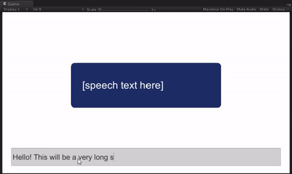

# FancySpeechBubble
A fancy speech bubble based on Unity UI Text

## How to use this

Just download the Unity package [FancySpeechBubble.unitypackage](./FancySpeechBubble.unitypackage). I also have a [blog post](http://solosodium.github.io/2017-03-23-fancy-speech-bubble) about this.

## What's important

Everything happens in the script [FancySpeechBubble.cs](./Assets/FancySpeechBubble/FancySpeechBubble.cs). There are a few configurable parameters for the script:

| Parameter                    | Type   | Description                                                                      |
| :--------------------------- | :----- | :------------------------------------------------------------------------------- |
| **characterStartSize**       | int    | starting font size of character scale-up animation (default is 1)                |
| **characterAnimateSpeed**    | float  | charater scale-up animation speed (font size change / second) (default is 1000f) |
| **rawText**                  | string | *readonly*: raw text of the speech bubble                                        |
| **processedText**            | string | *readonly*: processed text with '\n' indicating line breaks                      |
| **bubbleBackground**         | Image  | *optional*: speech bubble background                                             |
| **backgroundMinimumHeight**  | float  | *optional*: speech bubble background minimm height                               |
| **backgroundVerticalMargin** | float  | *optional*: speech bubble background top and bottom margin combined              |

To see it in action, try run the [Example scene](./Assets/FancySpeechBubble/Example.unity).

## MIT Licence

Copyright 2017 solosodium

Permission is hereby granted, free of charge, to any person obtaining a copy of this software and associated documentation files (the "Software"), to deal in the Software without restriction, including without limitation the rights to use, copy, modify, merge, publish, distribute, sublicense, and/or sell copies of the Software, and to permit persons to whom the Software is furnished to do so, subject to the following conditions:

The above copyright notice and this permission notice shall be included in all copies or substantial portions of the Software.

THE SOFTWARE IS PROVIDED "AS IS", WITHOUT WARRANTY OF ANY KIND, EXPRESS OR IMPLIED, INCLUDING BUT NOT LIMITED TO THE WARRANTIES OF MERCHANTABILITY, FITNESS FOR A PARTICULAR PURPOSE AND NONINFRINGEMENT. IN NO EVENT SHALL THE AUTHORS OR COPYRIGHT HOLDERS BE LIABLE FOR ANY CLAIM, DAMAGES OR OTHER LIABILITY, WHETHER IN AN ACTION OF CONTRACT, TORT OR OTHERWISE, ARISING FROM, OUT OF OR IN CONNECTION WITH THE SOFTWARE OR THE USE OR OTHER DEALINGS IN THE SOFTWARE.
